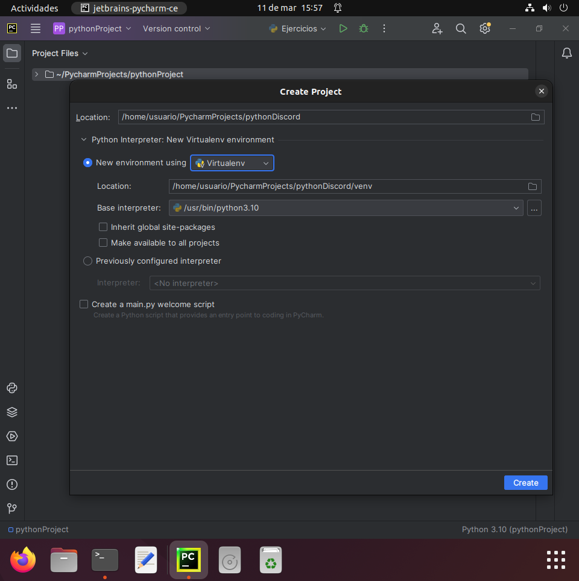
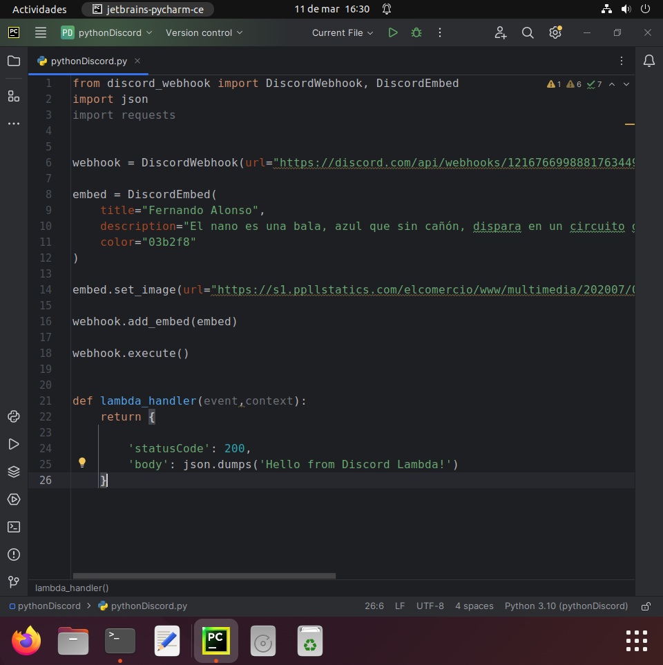
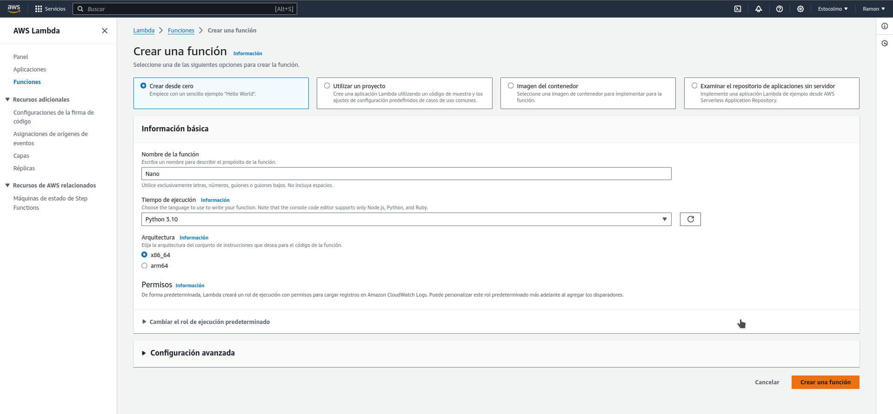
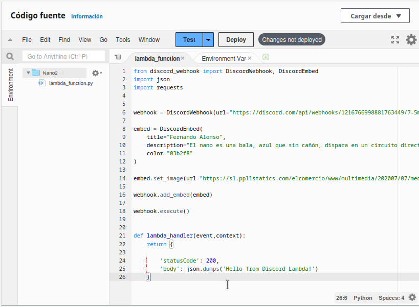
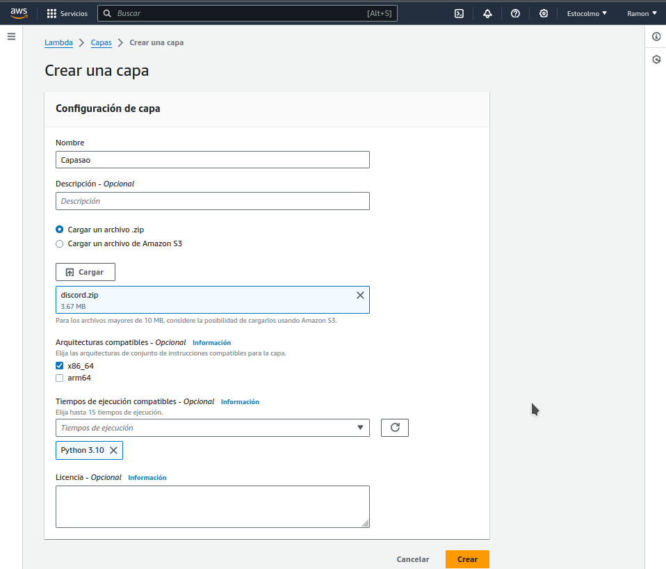
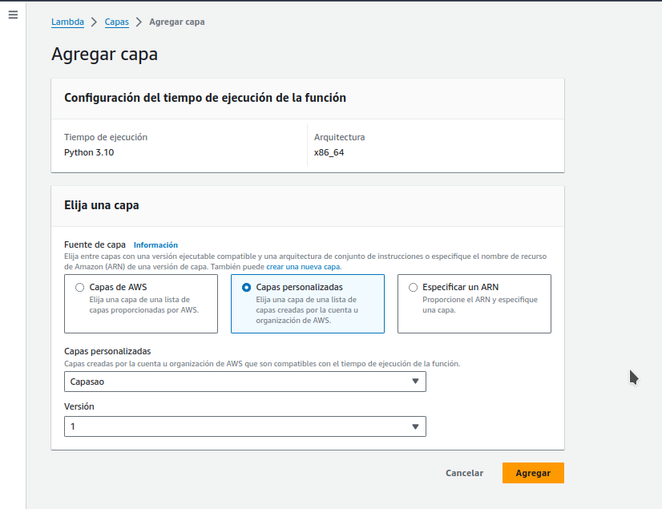
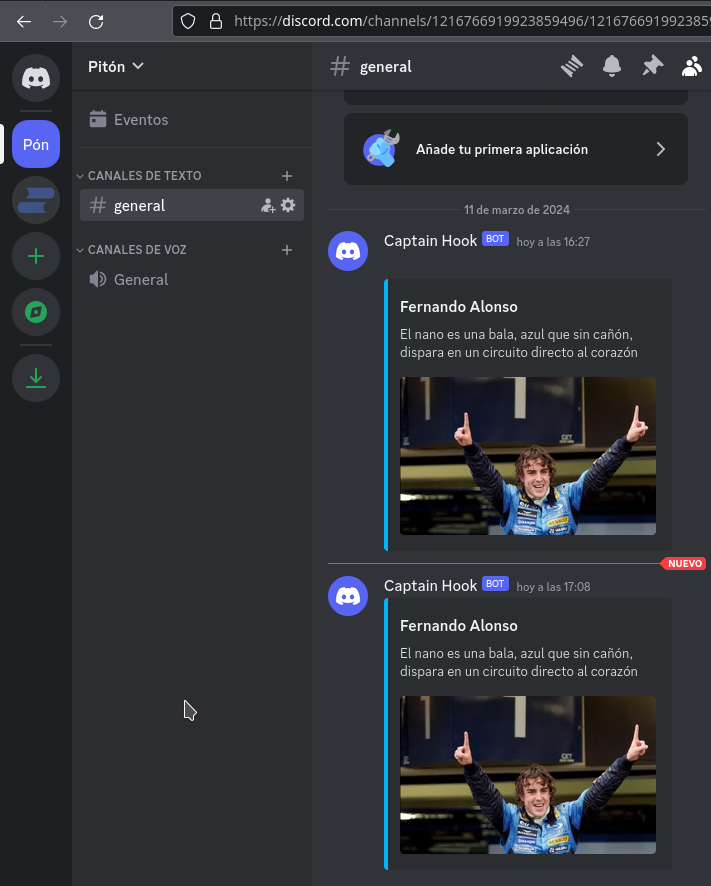

# AWS-Capas

## 1.Creación de la función

En primer lugar, en la interfaz de Pycharm crearemos un nuevo "virtual environment" para la realización de esta práctica.

Una vez creado el virtual environment, se crea el código para vincular la función de AWS con Discord.

 

Antes de trabajar la función con AWS probaremos que hace el webhook con Discord.

## 2.Trabajando con AWS

Desde la interfaz de AWS nos dirigimos a la pestaña Funciones del servicio Lambda para crear una nueva función. Es importante seleccionar la versión Python 3.10, similar a la utilzada en Pycharm

Se copia el código de python en la función de AWS creada previamente.

Una vez hecho esto, se crea una capa para la nueva función. En la capa cargaremos la librería lib de pycharm bajo el fichero comprimido "discord.zip". Es importante escoger la versión de Python 3.10.

Una vez creada la capa, agregaremos dicha capa a la función creada previamente.

Por último, invocaremos a la función con el botón test en la interfaz de AWS y comprobaremos que se vuelve a publicar el webhook en Discord.

